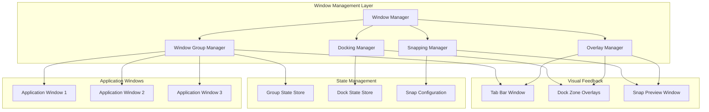
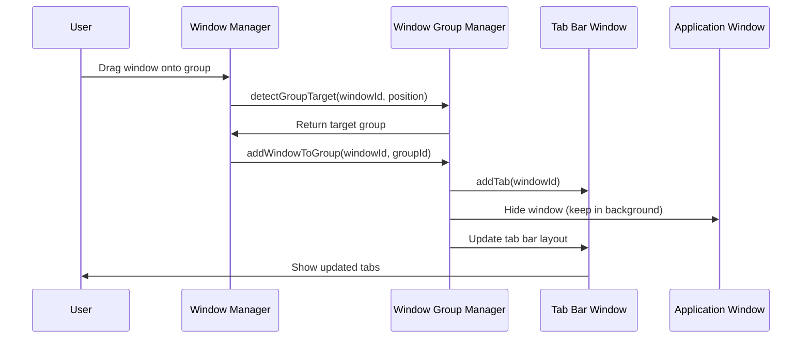
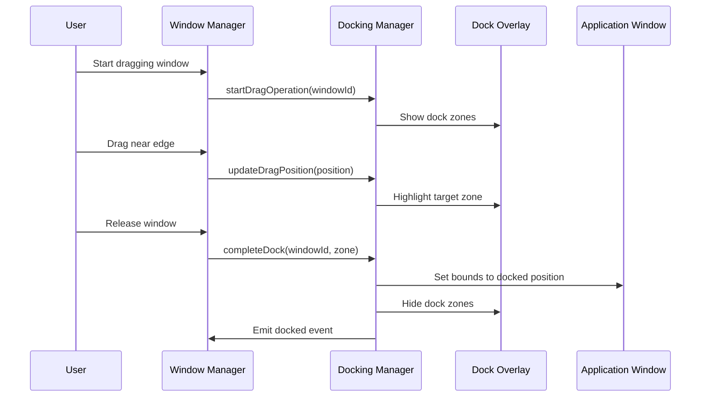
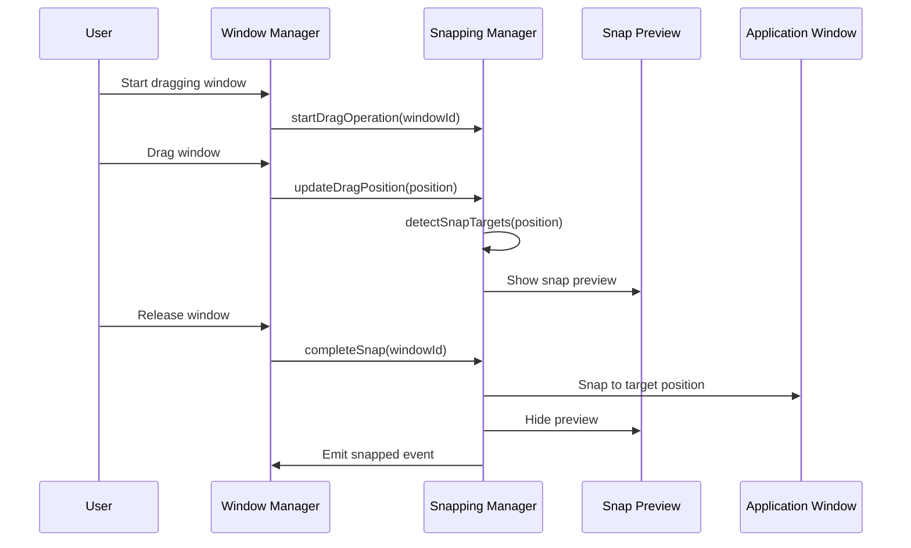

# Design Document

## Overview

This design document details the implementation of advanced window management features for the desktop interoperability platform, including window grouping/tabbing, sophisticated docking, and intelligent snapping. These features build upon the existing WindowManager service to provide enterprise-grade window organization capabilities.

The design follows a modular architecture where specialized managers handle specific aspects of window management (grouping, docking, snapping) while coordinating through the central WindowManager. This approach ensures separation of concerns and maintainability.

### Key Design Decisions

1. **Separate Manager Classes**: WindowGroupManager, DockingManager, and SnappingManager handle specific concerns
2. **Event-Driven Architecture**: Window management operations emit events for UI updates and state synchronization
3. **Visual Overlay System**: Separate overlay windows provide visual feedback without interfering with application windows
4. **Snap Target Detection**: Efficient spatial indexing for fast snap target detection during drag operations
5. **State Persistence**: Group and docking configurations stored in workspace snapshots
6. **Cross-Platform Compatibility**: Use Electron APIs that work consistently across Windows, macOS, and Linux

### Design Trade-offs

| Decision | Benefit | Trade-off |
|----------|---------|-----------|
| Separate overlay windows | Clean separation, no app interference | Additional window management overhead |
| Event-driven updates | Loose coupling, extensibility | Complexity in event handling |
| Spatial indexing | Fast snap detection | Memory overhead for index structures |
| Tab bar as separate window | Flexibility in positioning | Synchronization complexity |
| Persistent group state | Workspace restoration | Storage overhead |

## Architecture

### High-Level Architecture



### Component Interaction Flow

#### Window Grouping Flow



#### Docking Flow



#### Snapping Flow



## Components and Interfaces

### 1. Window Group Manager

**Responsibility**: Manage window groups, tab bars, tab switching, and group lifecycle.

**Key Classes**:
- `WindowGroupManager`: Core group management
- `TabBarWindow`: Custom window displaying tabs
- `GroupStateStore`: Persists group configurations

**Interfaces**:
```typescript
interface IWindowGroupManager {
  createGroup(windowIds: string[]): Promise<WindowGroup>;
  addWindowToGroup(windowId: string, groupId: string): Promise<void>;
  removeWindowFromGroup(windowId: string): Promise<void>;
  getWindowGroup(windowId: string): WindowGroup | null;
  listGroups(): WindowGroup[];
  setActiveTab(groupId: string, windowId: string): Promise<void>;
  reorderTabs(groupId: string, windowIds: string[]): Promise<void>;
  closeGroup(groupId: string, action: 'closeAll' | 'ungroup'): Promise<void>;
  moveGroup(groupId: string, x: number, y: number): Promise<void>;
  resizeGroup(groupId: string, width: number, height: number): Promise<void>;
}

interface WindowGroup {
  id: string;
  windows: string[];
  activeWindow: string;
  bounds: Bounds;
  tabBarWindow: BrowserWindow;
  state: 'normal' | 'minimized' | 'maximized';
  createdAt: Date;
}

interface TabBarWindow {
  window: BrowserWindow;
  groupId: string;
  render(): void;
  handleTabClick(windowId: string): void;
  handleTabDrag(windowId: string, position: Point): void;
  handleTabClose(windowId: string): void;
}
```

**Implementation Details**:

1. **Tab Bar Rendering**:
   - Tab bar is a frameless, always-on-top window positioned above the group
   - Tabs show application icon, title, and close button
   - Active tab is highlighted
   - Tab width adjusts based on number of tabs (minimum 100px, maximum 200px)

2. **Group Synchronization**:
   - When group moves, tab bar moves with it
   - When group resizes, tab bar width adjusts
   - When group minimizes, tab bar minimizes
   - When group maximizes, tab bar stays at top

3. **Tab Switching**:
   - Clicking a tab brings that window to front (z-order)
   - Other windows in group remain hidden behind
   - Tab bar always stays on top of group

4. **Drag and Drop**:
   - Dragging a tab out creates a new independent window
   - Dragging a window onto a tab bar adds it to the group
   - Dragging between tab bars moves window between groups

### 2. Docking Manager

**Responsibility**: Handle window docking to screen edges, corners, and other windows with visual feedback.

**Key Classes**:
- `DockingManager`: Core docking logic
- `DockZoneOverlay`: Visual overlay showing dock zones
- `DockStateStore`: Persists docking relationships

**Interfaces**:
```typescript
interface IDockingManager {
  startDragOperation(windowId: string): void;
  updateDragPosition(windowId: string, position: Point): void;
  completeDock(windowId: string): Promise<void>;
  cancelDock(windowId: string): void;
  undockWindow(windowId: string): Promise<void>;
  getDockZones(monitor: number): DockZone[];
  getDockedWindows(): DockedWindow[];
  setDockZoneConfig(config: DockZoneConfig): void;
}

interface DockZone {
  id: string;
  type: 'edge' | 'corner' | 'custom';
  edge?: 'left' | 'right' | 'top' | 'bottom';
  corner?: 'top-left' | 'top-right' | 'bottom-left' | 'bottom-right';
  bounds: Bounds;
  targetBounds: Bounds; // Where window will be positioned
  monitor: number;
  priority: number;
}

interface DockedWindow {
  windowId: string;
  zone: DockZone;
  originalBounds: Bounds; // For undocking
  dockedAt: Date;
}

interface DockZoneConfig {
  edgeThreshold: number; // Distance from edge to trigger (default: 20px)
  cornerSize: number; // Size of corner zones (default: 100px)
  showOverlays: boolean; // Show visual overlays (default: true)
  animationDuration: number; // Dock animation duration (default: 200ms)
  customZones?: CustomDockZone[];
}

interface CustomDockZone {
  id: string;
  bounds: Bounds;
  targetBounds: Bounds;
  monitor: number;
}
```

**Implementation Details**:

1. **Dock Zone Detection**:
   - Monitor mouse position during drag
   - Calculate distance to all dock zones
   - Activate zone when within threshold
   - Prioritize zones by distance and priority

2. **Visual Feedback**:
   - Show semi-transparent overlays on all monitors
   - Highlight active zone with different color
   - Show preview of window in target position
   - Animate overlay appearance/disappearance

3. **Docking Behavior**:
   - Edge docking: Window takes half of screen
   - Corner docking: Window takes quarter of screen
   - Top edge: Maximize window
   - Custom zones: Use configured bounds

4. **Multi-Monitor Support**:
   - Detect dock zones on all monitors
   - Handle dragging between monitors
   - Adjust zones based on monitor resolution
   - Handle monitor disconnect/reconnect

### 3. Snapping Manager

**Responsibility**: Provide intelligent window snapping to edges, other windows, and grid positions.

**Key Classes**:
- `SnappingManager`: Core snapping logic
- `SnapTargetDetector`: Efficient snap target detection
- `SnapPreviewWindow`: Visual preview of snap position
- `SpatialIndex`: Spatial indexing for fast target detection

**Interfaces**:
```typescript
interface ISnappingManager {
  startDragOperation(windowId: string): void;
  updateDragPosition(windowId: string, position: Point, size: Size): void;
  completeSnap(windowId: string): Promise<void>;
  cancelSnap(windowId: string): void;
  detectSnapTargets(position: Point, size: Size): SnapTarget[];
  setSnapConfig(config: SnapConfig): void;
  enableSnapping(enabled: boolean): void;
  isSnappingEnabled(): boolean;
}

interface SnapTarget {
  id: string;
  type: 'edge' | 'window' | 'grid';
  position: Point;
  alignment: 'left' | 'right' | 'top' | 'bottom' | 'center';
  distance: number;
  targetBounds: Bounds;
  priority: number;
}

interface SnapConfig {
  enabled: boolean;
  snapDistance: number; // Distance to trigger snap (default: 10px)
  snapToEdges: boolean; // Snap to screen edges (default: true)
  snapToWindows: boolean; // Snap to other windows (default: true)
  snapToGrid: boolean; // Snap to grid (default: false)
  gridSize: number; // Grid cell size (default: 50px)
  showPreview: boolean; // Show snap preview (default: true)
  animationDuration: number; // Snap animation duration (default: 150ms)
  maintainSnapOnResize: boolean; // Keep windows snapped during resize (default: true)
}

interface SpatialIndex {
  insert(windowId: string, bounds: Bounds): void;
  remove(windowId: string): void;
  update(windowId: string, bounds: Bounds): void;
  query(bounds: Bounds, maxDistance: number): string[];
  clear(): void;
}
```

**Implementation Details**:

1. **Snap Target Detection**:
   - Use spatial indexing (R-tree or grid-based) for efficient queries
   - Detect edges of screen and other windows
   - Calculate snap points for each edge (left, right, top, bottom)
   - Prioritize targets by distance and alignment

2. **Grid Snapping**:
   - Divide screen into configurable grid
   - Snap window corners to grid intersections
   - Snap window edges to grid lines
   - Support different grid sizes per monitor

3. **Window-to-Window Snapping**:
   - Detect edges of all visible windows
   - Align edges when within snap distance
   - Support edge-to-edge and edge-to-center alignment
   - Maintain snap relationships during resize

4. **Snap Relationships**:
   - Track which windows are snapped together
   - When resizing a window, adjust snapped neighbors
   - Proportionally distribute space among snapped windows
   - Break snap relationship when manually moved

5. **Performance Optimization**:
   - Update spatial index only when windows move/resize
   - Throttle snap detection to 60 FPS
   - Use bounding box queries to limit candidates
   - Cache snap targets during drag operation

### 4. Overlay Manager

**Responsibility**: Manage visual feedback overlays for docking, snapping, and grouping operations.

**Key Classes**:
- `OverlayManager`: Coordinates all overlays
- `OverlayWindow`: Base class for overlay windows
- `DockZoneOverlay`: Dock zone visualization
- `SnapPreviewOverlay`: Snap preview visualization
- `GroupDropZoneOverlay`: Group drop zone visualization

**Interfaces**:
```typescript
interface IOverlayManager {
  showDockZones(monitor?: number): void;
  hideDockZones(): void;
  highlightDockZone(zoneId: string): void;
  showSnapPreview(bounds: Bounds): void;
  hideSnapPreview(): void;
  showGroupDropZone(groupId: string): void;
  hideGroupDropZone(): void;
  setOverlayConfig(config: OverlayConfig): void;
}

interface OverlayConfig {
  dockZoneColor: string; // Default: 'rgba(0, 120, 215, 0.3)'
  dockZoneActiveColor: string; // Default: 'rgba(0, 120, 215, 0.6)'
  snapPreviewColor: string; // Default: 'rgba(0, 120, 215, 0.4)'
  groupDropZoneColor: string; // Default: 'rgba(0, 180, 120, 0.4)'
  borderWidth: number; // Default: 2
  borderRadius: number; // Default: 4
  animationDuration: number; // Default: 150ms
}

interface OverlayWindow {
  window: BrowserWindow;
  show(): void;
  hide(): void;
  setBounds(bounds: Bounds): void;
  setColor(color: string): void;
  destroy(): void;
}
```

**Implementation Details**:

1. **Overlay Windows**:
   - Frameless, transparent windows
   - Always on top, click-through enabled
   - No taskbar entry
   - Hardware acceleration for smooth rendering

2. **Rendering**:
   - Use HTML5 Canvas or CSS for rendering
   - Smooth fade in/out animations
   - Responsive to window movements
   - Minimal CPU/GPU usage

3. **Multi-Monitor Support**:
   - Create overlay windows for each monitor
   - Position overlays correctly on each display
   - Handle monitor configuration changes

### 5. Enhanced Window Manager

**Responsibility**: Coordinate all window management features and provide unified API.

**Extended Interfaces**:
```typescript
interface IWindowManager {
  // Existing methods...
  
  // Grouping
  createWindowGroup(windowIds: string[]): Promise<WindowGroup>;
  addToGroup(windowId: string, groupId: string): Promise<void>;
  removeFromGroup(windowId: string): Promise<void>;
  getWindowGroup(windowId: string): WindowGroup | null;
  setActiveTabInGroup(groupId: string, windowId: string): Promise<void>;
  
  // Docking
  dockWindow(windowId: string, zone: DockZone): Promise<void>;
  undockWindow(windowId: string): Promise<void>;
  getDockZones(monitor?: number): DockZone[];
  
  // Snapping
  snapWindow(windowId: string, target: SnapTarget): Promise<void>;
  enableSnapping(enabled: boolean): void;
  getSnapTargets(windowId: string): SnapTarget[];
  
  // Events
  on(event: WindowManagementEvent, handler: EventHandler): void;
  off(event: WindowManagementEvent, handler: EventHandler): void;
}

type WindowManagementEvent =
  | 'window-grouped'
  | 'window-ungrouped'
  | 'window-docked'
  | 'window-undocked'
  | 'window-snapped'
  | 'group-moved'
  | 'group-resized'
  | 'tab-switched'
  | 'drag-started'
  | 'drag-ended';

interface EventHandler {
  (data: any): void;
}
```

## Data Models

### Window Group Schema

```typescript
interface WindowGroupData {
  id: string;
  windows: string[];
  activeWindow: string;
  bounds: {
    x: number;
    y: number;
    width: number;
    height: number;
  };
  tabBarBounds: {
    x: number;
    y: number;
    width: number;
    height: number;
  };
  state: 'normal' | 'minimized' | 'maximized';
  monitor: number;
  createdAt: string;
  updatedAt: string;
}
```

### Dock State Schema

```typescript
interface DockStateData {
  windowId: string;
  zoneId: string;
  zonetype: 'edge' | 'corner' | 'custom';
  originalBounds: {
    x: number;
    y: number;
    width: number;
    height: number;
  };
  dockedBounds: {
    x: number;
    y: number;
    width: number;
    height: number;
  };
  monitor: number;
  dockedAt: string;
}
```

### Snap Relationship Schema

```typescript
interface SnapRelationshipData {
  windowId: string;
  snappedTo: string[]; // Window IDs
  edges: {
    left?: string; // Window ID snapped to left edge
    right?: string;
    top?: string;
    bottom?: string;
  };
  createdAt: string;
}
```

### Workspace Extension

Extend existing workspace schema to include grouping and docking:

```typescript
interface WorkspaceData {
  // Existing fields...
  
  groups?: WindowGroupData[];
  dockedWindows?: DockStateData[];
  snapRelationships?: SnapRelationshipData[];
}
```

## Error Handling

### Error Categories

1. **Group Management Errors**: Invalid window IDs, group not found, tab bar creation failure
2. **Docking Errors**: Invalid dock zone, monitor not found, bounds calculation failure
3. **Snapping Errors**: Snap target detection failure, spatial index corruption
4. **Overlay Errors**: Overlay window creation failure, rendering errors
5. **State Persistence Errors**: Failed to save/load group state, corrupted state data

### Error Handling Strategy

```typescript
class WindowManagementError extends Error {
  constructor(
    message: string,
    public code: string,
    public category: 'grouping' | 'docking' | 'snapping' | 'overlay' | 'persistence',
    public recoverable: boolean,
    public context?: any
  ) {
    super(message);
  }
}

// Error codes
const ErrorCodes = {
  GROUP_NOT_FOUND: 'WM_GROUP_001',
  INVALID_WINDOW_ID: 'WM_GROUP_002',
  TAB_BAR_CREATION_FAILED: 'WM_GROUP_003',
  INVALID_DOCK_ZONE: 'WM_DOCK_001',
  MONITOR_NOT_FOUND: 'WM_DOCK_002',
  SNAP_DETECTION_FAILED: 'WM_SNAP_001',
  OVERLAY_CREATION_FAILED: 'WM_OVERLAY_001',
  STATE_SAVE_FAILED: 'WM_PERSIST_001',
  STATE_LOAD_FAILED: 'WM_PERSIST_002'
};
```

### Recovery Mechanisms

- **Group Creation Failure**: Clean up partial group state, notify user
- **Tab Bar Failure**: Fall back to non-tabbed group, log error
- **Docking Failure**: Restore original window position
- **Snapping Failure**: Disable snapping temporarily, allow manual positioning
- **Overlay Failure**: Continue without visual feedback, log warning
- **State Load Failure**: Skip corrupted entries, load remaining state

## Performance Considerations

### Optimization Strategies

1. **Spatial Indexing**:
   - Use R-tree for efficient window queries
   - Update index incrementally on window move/resize
   - Cache query results during drag operations

2. **Event Throttling**:
   - Throttle drag position updates to 60 FPS
   - Debounce window resize events
   - Batch state updates

3. **Overlay Rendering**:
   - Use CSS transforms for smooth animations
   - Enable hardware acceleration
   - Minimize repaints with will-change CSS property

4. **Memory Management**:
   - Destroy overlay windows when not in use
   - Clean up event listeners on window close
   - Limit spatial index size with LRU eviction

5. **Multi-Monitor**:
   - Create overlays on-demand per monitor
   - Cache monitor configurations
   - Handle monitor changes asynchronously

### Performance Targets

- Drag operation latency: < 16ms (60 FPS)
- Snap target detection: < 5ms
- Group creation: < 100ms
- Tab switching: < 50ms
- Overlay show/hide: < 150ms
- State persistence: < 200ms

## Testing Strategy

### Unit Testing

**Key Test Areas**:
- WindowGroupManager: Group creation, tab management, state tracking
- DockingManager: Zone detection, docking calculations, multi-monitor
- SnappingManager: Snap target detection, spatial indexing, relationship tracking
- OverlayManager: Overlay lifecycle, positioning, rendering

### Integration Testing

**Key Test Scenarios**:
- Create group with multiple windows, verify tab bar
- Dock window to edge, verify bounds and state
- Snap windows together, verify alignment
- Drag window between monitors, verify zone detection
- Resize snapped windows, verify relationship maintenance

### End-to-End Testing

**Key Workflows**:
- Group 3 windows, switch tabs, drag tab out
- Dock windows to all edges and corners
- Create complex snap relationships, resize windows
- Save workspace with groups, restore workspace
- Handle monitor disconnect with grouped windows

### Performance Testing

**Benchmarks**:
- Drag 20 windows simultaneously
- Create groups with 50+ windows
- Snap detection with 100+ windows on screen
- Multi-monitor with 6 displays

## API Examples

### Grouping API

```typescript
// Create a group
const group = await windowManager.createWindowGroup(['window-1', 'window-2', 'window-3']);

// Add window to existing group
await windowManager.addToGroup('window-4', group.id);

// Switch active tab
await windowManager.setActiveTabInGroup(group.id, 'window-2');

// Remove window from group
await windowManager.removeFromGroup('window-3');

// Listen for group events
windowManager.on('window-grouped', (data) => {
  console.log(`Window ${data.windowId} added to group ${data.groupId}`);
});
```

### Docking API

```typescript
// Get available dock zones
const zones = windowManager.getDockZones();

// Dock window to left edge
await windowManager.dockWindow('window-1', zones.find(z => z.edge === 'left'));

// Undock window
await windowManager.undockWindow('window-1');

// Listen for dock events
windowManager.on('window-docked', (data) => {
  console.log(`Window ${data.windowId} docked to ${data.zone.edge}`);
});
```

### Snapping API

```typescript
// Enable/disable snapping
windowManager.enableSnapping(true);

// Get snap targets for a window
const targets = windowManager.getSnapTargets('window-1');

// Snap to specific target
await windowManager.snapWindow('window-1', targets[0]);

// Configure snapping
windowManager.setSnapConfig({
  snapDistance: 15,
  snapToGrid: true,
  gridSize: 100
});
```

## Migration and Compatibility

### Backward Compatibility

- Existing WindowManager API remains unchanged
- New features are additive, not breaking
- Workspaces without group/dock data load normally
- Applications unaware of grouping continue to work

### Migration Path

1. Update WindowManager with new managers
2. Add overlay rendering system
3. Extend workspace schema
4. Update SDK with new APIs
5. Update documentation and examples

## Future Enhancements

- **Magnetic Windows**: Windows automatically align when moved close together
- **Window Layouts**: Predefined layouts (grid, cascade, tile)
- **Gesture Support**: Touch and trackpad gestures for window management
- **AI-Powered Layouts**: Learn user preferences and suggest layouts
- **Cross-Platform Consistency**: Ensure identical behavior on all platforms
- **Accessibility**: Full keyboard navigation and screen reader support
