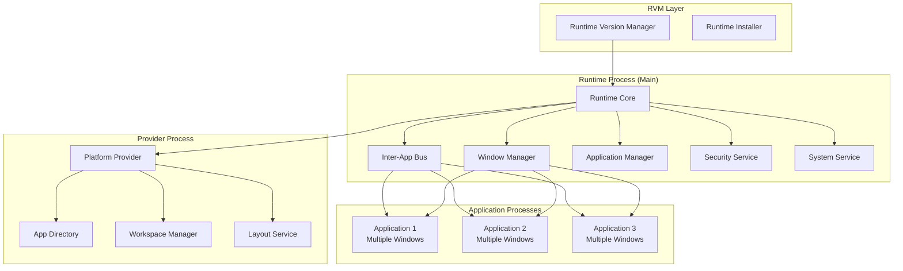
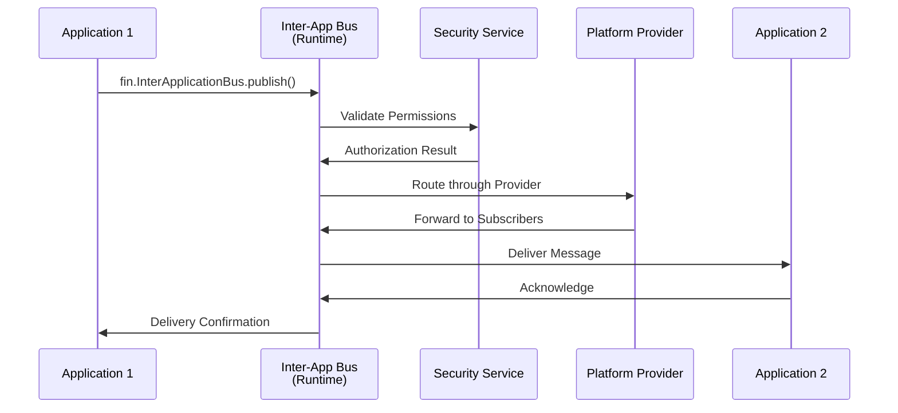
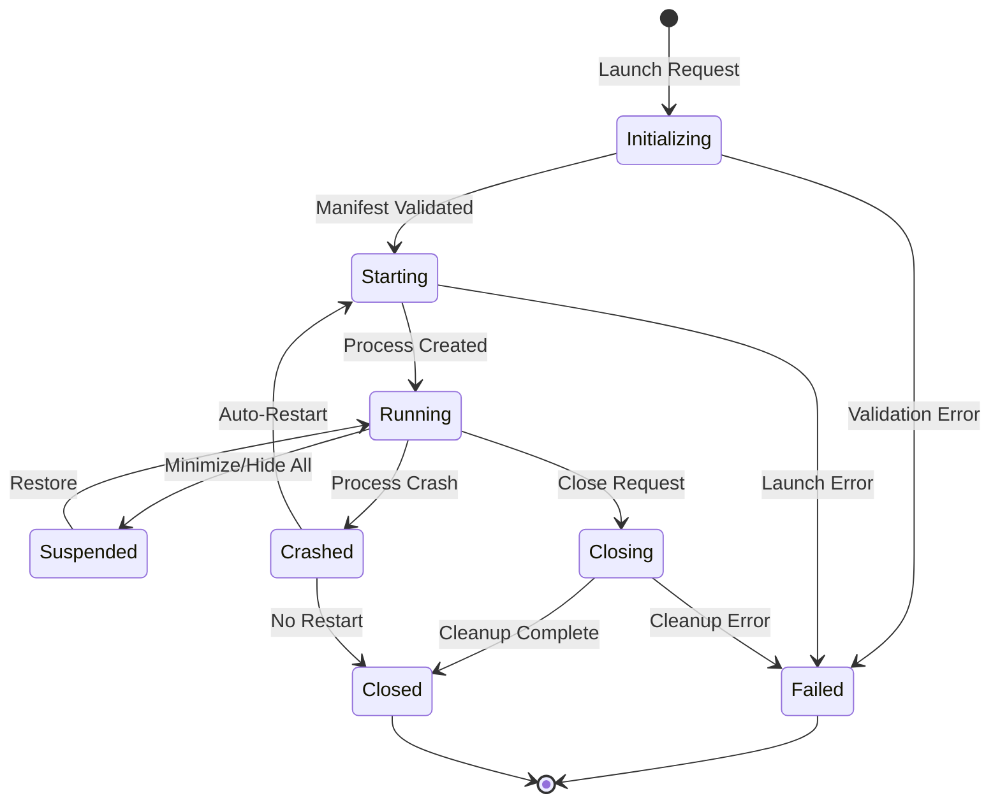
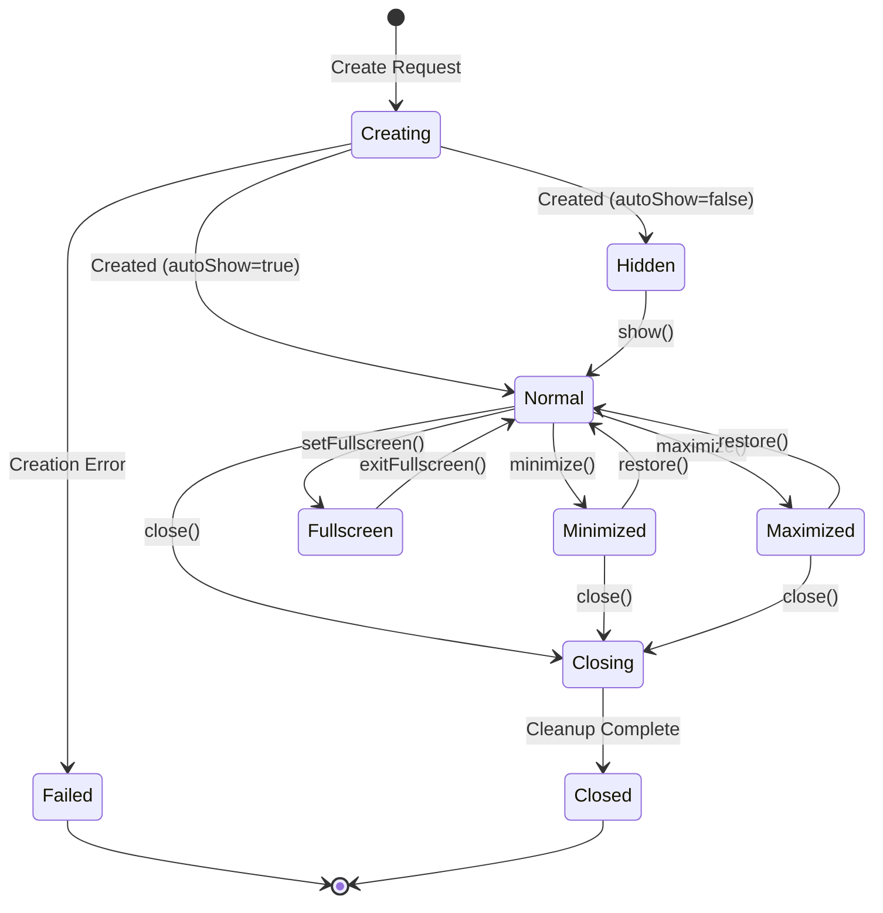
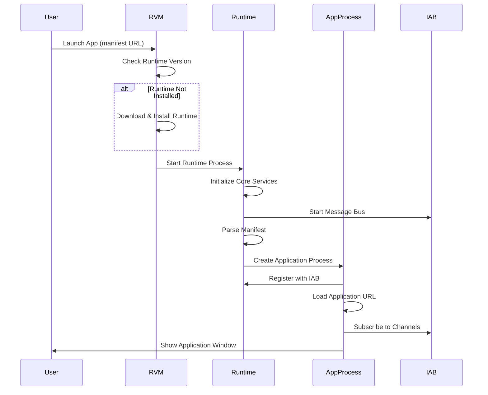
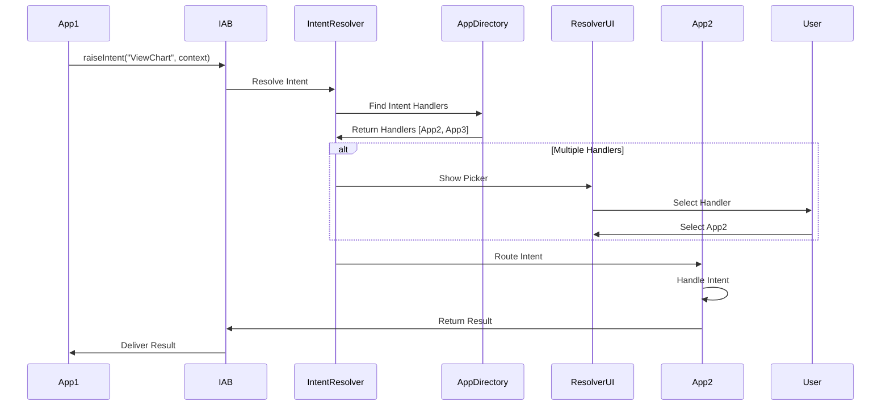
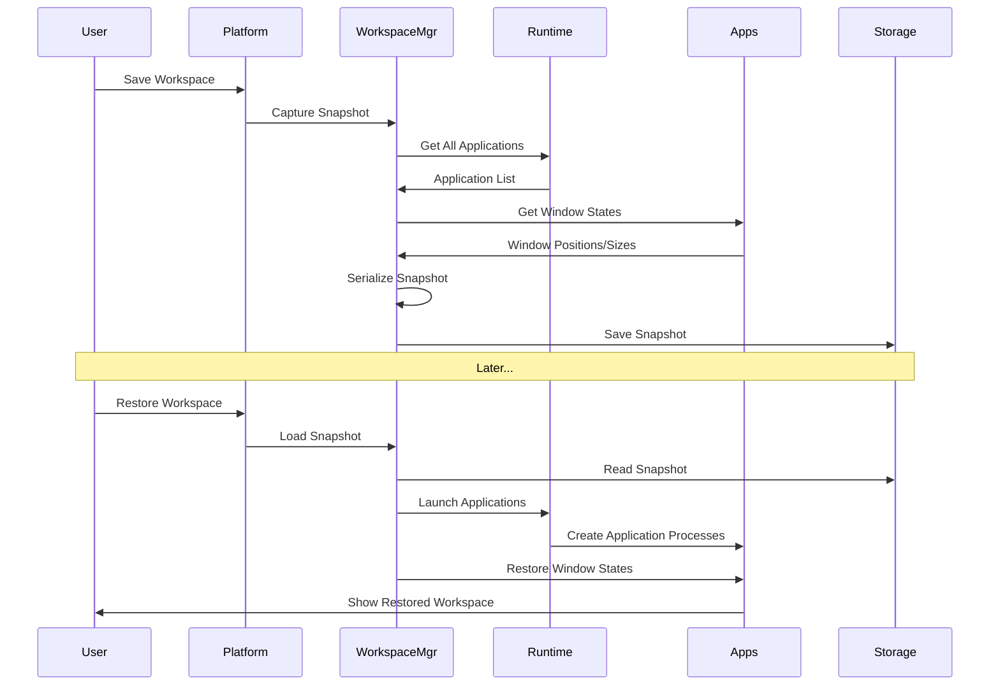

# Design Document

## Overview

The Desktop Interoperability Platform is a multi-process desktop runtime environment built on Electron/Chromium that enables seamless interoperability between web-based and native applications in enterprise environments. The platform provides a secure container runtime, FDC3-compliant inter-application messaging, sophisticated window management, and comprehensive application lifecycle management.

The architecture follows a microkernel pattern where a core runtime process manages system services, while individual applications run in isolated renderer processes. Communication between processes occurs through IPC channels with security validation at every boundary.

### Key Design Decisions

1. **Electron-Based Architecture**: Leverages Electron for cross-platform support, mature ecosystem, and Chromium's security model
2. **RVM Pattern**: Separates runtime version management from runtime execution, allowing multiple versions to coexist
3. **IAB Foundation**: Inter-Application Bus serves as the foundation for all messaging, with FDC3 as a higher-level abstraction
4. **Process Isolation**: Each application runs in its own process for security and stability
5. **Manifest-Driven**: Applications defined by JSON manifests, enabling dynamic deployment and updates
6. **Provider Extensibility**: Platform Provider pattern allows customization without modifying core runtime
7. **Security-First**: Context isolation, sandboxing, and permission model enforced at every layer

### Design Trade-offs

| Decision | Benefit | Trade-off |
|----------|---------|-----------|
| Electron-based | Cross-platform, mature, large ecosystem | Larger memory footprint than native |
| Multi-process | Isolation, stability, security | Higher memory usage, IPC overhead |
| WebSocket for IAB | Real-time, bidirectional, standard | Requires connection management |
| Manifest-driven | Flexible deployment, easy updates | Requires manifest hosting infrastructure |
| FDC3 on IAB | Standards compliance, interoperability | Additional abstraction layer |
| Provider pattern | Extensibility without core changes | Complexity in override management |

## Architecture

### High-Level Architecture

The architecture follows OpenFin's model with a Runtime Virtual Machine (RVM) pattern:



### Process Model

The platform uses a multi-process architecture similar to OpenFin:

- **RVM (Runtime Version Manager)**: Manages multiple runtime versions, handles installation and updates, launches appropriate runtime version
- **Runtime Process**: Single main process per runtime version that hosts core services (similar to OpenFin Runtime)
- **Provider Process**: Optional separate process for platform provider logic, workspace management, and custom services
- **Application Processes**: Each application runs in its own process, can contain multiple windows sharing the same process
- **Window Processes**: Individual windows can optionally run in separate processes for isolation

This matches OpenFin's architecture where:
- The RVM manages runtime versions and acts as a launcher
- The Runtime is the core container process
- Applications are isolated in separate processes
- A Platform Provider can extend functionality

### Communication Architecture

Similar to OpenFin's Inter-Application Bus (IAB):



The Inter-Application Bus provides:
- **Publish/Subscribe**: Topic-based messaging between applications
- **Send/Receive**: Direct point-to-point messaging
- **FDC3 Layer**: FDC3 API implemented on top of IAB primitives
- **Channel API**: User channels and app channels for context sharing
- **Security**: Message filtering and permission validation at the bus level

## Components and Interfaces

### 1. Runtime Version Manager (RVM)

**Responsibility**: Manage multiple runtime versions, handle installation and updates, launch appropriate runtime version (similar to OpenFin RVM).

**Key Classes**:
- `RuntimeVersionManager`: Manages installed runtime versions
- `RuntimeInstaller`: Downloads and installs runtime versions
- `RuntimeLauncher`: Launches appropriate runtime version for applications

**Interfaces**:
```typescript
interface IRuntimeVersionManager {
  getInstalledVersions(): Promise<string[]>;
  installVersion(version: string): Promise<void>;
  uninstallVersion(version: string): Promise<void>;
  launchRuntime(version: string, args: LaunchArgs): Promise<RuntimeProcess>;
  getLatestVersion(): Promise<string>;
}

interface RuntimeProcess {
  version: string;
  pid: number;
  port: number;
  shutdown(): Promise<void>;
}
```

### 2. Runtime Core

**Responsibility**: Main runtime process that hosts core services, manages application processes, coordinates inter-app communication (similar to OpenFin Runtime).

**Key Classes**:
- `RuntimeCore`: Main entry point, initializes all services
- `ProcessManager`: Manages application processes
- `ServiceRegistry`: Registers and provides access to core services

**Interfaces**:
```typescript
interface IRuntimeCore {
  initialize(config: RuntimeConfig): Promise<void>;
  shutdown(): Promise<void>;
  getService<T>(serviceName: string): T;
  getVersion(): string;
  getPort(): number;
}

interface IProcessManager {
  createApplicationProcess(manifest: ApplicationManifest): Promise<ApplicationProcess>;
  terminateProcess(processId: string): Promise<void>;
  getProcess(processId: string): ApplicationProcess | null;
  listProcesses(): ApplicationProcess[];
}
```

### 3. Inter-Application Bus (IAB)

**Responsibility**: Core messaging infrastructure for inter-application communication, similar to OpenFin's IAB. Provides publish/subscribe, send/receive, and serves as foundation for FDC3.

**Key Classes**:
- `InterApplicationBus`: Core message bus implementation
- `MessageRouter`: Routes messages between applications
- `TopicManager`: Manages pub/sub topics and subscriptions
- `ChannelManager`: Manages FDC3 channels on top of IAB

**Interfaces**:
```typescript
interface IInterApplicationBus {
  // Pub/Sub
  publish(topic: string, message: any): Promise<void>;
  subscribe(topic: string, handler: MessageHandler): Subscription;
  unsubscribe(subscription: Subscription): void;
  
  // Send/Receive
  send(targetUuid: string, targetName: string, topic: string, message: any): Promise<any>;
  addReceiveListener(topic: string, handler: MessageHandler): Listener;
  
  // Application discovery
  getAllApplications(): Promise<ApplicationInfo[]>;
  getApplicationInfo(uuid: string): Promise<ApplicationInfo>;
}

interface MessageHandler {
  (message: any, sender: MessageSender): void | Promise<any>;
}

interface MessageSender {
  uuid: string;
  name: string;
  windowName?: string;
}
```

### 4. Application Lifecycle Manager

**Responsibility**: Parse manifests, launch applications, manage application state, handle crashes.

**Key Classes**:
- `ApplicationLifecycleManager`: Orchestrates application lifecycle
- `ManifestParser`: Validates and parses application manifests
- `ApplicationInstance`: Represents a running application
- `CrashHandler`: Detects and handles application crashes

**Interfaces**:
```typescript
interface IApplicationLifecycleManager {
  launchApplication(manifestUrl: string, config?: LaunchConfig): Promise<ApplicationInstance>;
  closeApplication(appId: string): Promise<void>;
  restartApplication(appId: string): Promise<ApplicationInstance>;
  getApplication(appId: string): ApplicationInstance | null;
  listApplications(): ApplicationInstance[];
}

interface ApplicationManifest {
  appId: string;
  name: string;
  version: string;
  url: string;
  icon?: string;
  permissions: Permission[];
  windowOptions?: WindowOptions;
  intents?: IntentMetadata[];
}

interface ApplicationInstance {
  id: string;
  appId: string;
  manifest: ApplicationManifest;
  windows: Window[];
  state: 'launching' | 'running' | 'suspended' | 'crashed';
  createdAt: Date;
}
```

### 5. Window Manager

**Responsibility**: Create and manage windows, handle window state, coordinate multi-monitor layouts, implement docking and grouping.

**Key Classes**:
- `WindowManager`: Central window management service
- `WindowInstance`: Wrapper around BrowserWindow with enhanced capabilities
- `WindowGroupManager`: Manages window groups and tabs
- `DockingManager`: Handles window docking and snapping

**Interfaces**:
```typescript
interface IWindowManager {
  createWindow(options: WindowOptions): Promise<WindowInstance>;
  closeWindow(windowId: string): Promise<void>;
  getWindow(windowId: string): WindowInstance | null;
  listWindows(): WindowInstance[];
  groupWindows(windowIds: string[]): WindowGroup;
  dockWindow(windowId: string, edge: DockEdge): void;
}

interface WindowOptions {
  url: string;
  width?: number;
  height?: number;
  frame?: boolean;
  customChrome?: boolean;
  resizable?: boolean;
  position?: { x: number; y: number };
  state?: 'normal' | 'minimized' | 'maximized' | 'fullscreen';
}

interface WindowInstance {
  id: string;
  browserWindow: BrowserWindow;
  options: WindowOptions;
  state: WindowState;
  bounds: Rectangle;
  monitor: number;
  group?: WindowGroup;
}
```

### 6. FDC3 Service (Built on IAB)

**Responsibility**: Implement FDC3 standard on top of the Inter-Application Bus, manage channels, resolve intents, route context. This matches OpenFin's approach where FDC3 is a layer above the IAB.

**Key Classes**:
- `FDC3MessageBus`: Core messaging infrastructure
- `ChannelManager`: Manages user and app channels
- `IntentResolver`: Resolves intents to handler applications
- `ContextRouter`: Routes context messages to subscribers

**Interfaces**:
```typescript
interface IFDC3MessageBus {
  broadcast(context: Context): Promise<void>;
  raiseIntent(intent: string, context: Context, target?: string): Promise<IntentResolution>;
  addContextListener(contextType: string, handler: ContextHandler): Listener;
  addIntentListener(intent: string, handler: IntentHandler): Listener;
  getOrCreateChannel(channelId: string): Channel;
  getUserChannels(): Channel[];
  joinChannel(channelId: string): Promise<void>;
  leaveChannel(): Promise<void>;
}

interface Context {
  type: string;
  id?: { [key: string]: string };
  name?: string;
  [key: string]: any;
}

interface IntentResolution {
  source: string;
  version?: string;
  data?: any;
}

interface Channel {
  id: string;
  type: 'user' | 'app' | 'private';
  broadcast(context: Context): Promise<void>;
  getCurrentContext(contextType?: string): Promise<Context | null>;
  addContextListener(contextType: string, handler: ContextHandler): Listener;
}
```

### 7. Platform Provider

**Responsibility**: Extensible provider layer for custom platform logic, workspace management, and layout services (similar to OpenFin Platform Provider).

**Key Classes**:
- `PlatformProvider`: Main provider implementation
- `WorkspaceManager`: Manages workspaces (collections of applications and layouts)
- `LayoutManager`: Saves and restores window layouts
- `SnapshotService`: Captures and restores platform state

**Interfaces**:
```typescript
interface IPlatformProvider {
  initialize(config: ProviderConfig): Promise<void>;
  overrideCallback(callback: string, handler: Function): void;
  getWorkspaceManager(): IWorkspaceManager;
  getLayoutManager(): ILayoutManager;
}

interface IWorkspaceManager {
  createWorkspace(config: WorkspaceConfig): Promise<Workspace>;
  getWorkspace(id: string): Promise<Workspace>;
  listWorkspaces(): Promise<Workspace[]>;
  deleteWorkspace(id: string): Promise<void>;
}

interface Workspace {
  id: string;
  name: string;
  applications: ApplicationConfig[];
  layout: LayoutConfig;
  snapshot: WorkspaceSnapshot;
  launch(): Promise<void>;
  save(): Promise<void>;
}
```

### 8. Application Directory Service

**Responsibility**: Maintain registry of available applications, support search and discovery, validate manifests.

**Key Classes**:
- `ApplicationDirectory`: Central directory service
- `ManifestRegistry`: Stores and indexes application manifests
- `SearchEngine`: Implements application search functionality

**Interfaces**:
```typescript
interface IApplicationDirectory {
  registerApplication(manifest: ApplicationManifest): Promise<void>;
  unregisterApplication(appId: string): Promise<void>;
  getApplication(appId: string): Promise<ApplicationManifest | null>;
  searchApplications(query: string): Promise<ApplicationManifest[]>;
  findIntentHandlers(intent: string, context?: Context): Promise<ApplicationManifest[]>;
  listApplications(): Promise<ApplicationManifest[]>;
}
```

### 9. Security Manager

**Responsibility**: Enforce permissions, validate operations, manage content security policies, handle encryption.

**Key Classes**:
- `SecurityManager`: Central security enforcement
- `PermissionValidator`: Validates permission requests
- `ContentSecurityPolicy`: Manages CSP rules
- `EncryptionService`: Handles data encryption

**Interfaces**:
```typescript
interface ISecurityManager {
  validatePermission(appId: string, permission: Permission): Promise<boolean>;
  requestPermission(appId: string, permission: Permission): Promise<boolean>;
  enforceCSP(appId: string, url: string): Promise<boolean>;
  encryptData(data: any, key: string): Promise<string>;
  decryptData(encrypted: string, key: string): Promise<any>;
  validateMessageRoute(fromAppId: string, toAppId: string): Promise<boolean>;
}

interface Permission {
  type: 'clipboard' | 'notifications' | 'filesystem' | 'network' | 'messaging';
  scope?: string;
  granted?: boolean;
}
```

### 10. Configuration Service

**Responsibility**: Load and manage platform configuration, support runtime updates, handle environment-specific settings.

**Key Classes**:
- `ConfigurationService`: Manages configuration lifecycle
- `ConfigValidator`: Validates configuration schemas
- `ConfigWatcher`: Monitors configuration file changes

**Interfaces**:
```typescript
interface IConfigurationService {
  load(): Promise<PlatformConfig>;
  get<T>(key: string): T;
  set(key: string, value: any): Promise<void>;
  reload(): Promise<void>;
  watch(key: string, callback: (value: any) => void): void;
}

interface PlatformConfig {
  runtime: RuntimeConfig;
  security: SecurityConfig;
  applications: ApplicationConfig;
  ui: UIConfig;
  logging: LoggingConfig;
}
```

### 11. Platform SDK (fin API)

**Responsibility**: Provide JavaScript/TypeScript API for application developers (similar to OpenFin's `fin` global object), abstract IAB communication, expose platform capabilities.

**Key Classes**:
- `PlatformClient`: Main SDK entry point injected into renderer processes
- `WindowAPI`: Window management APIs
- `FDC3API`: FDC3-compliant messaging APIs
- `SystemAPI`: System integration APIs

**Interfaces** (matching OpenFin's `fin` API structure):
```typescript
// Global fin object injected into all windows
interface Fin {
  Application: IApplicationAPI;
  Window: IWindowAPI;
  InterApplicationBus: IInterApplicationBusAPI;
  System: ISystemAPI;
  Platform: IPlatformAPI;
  me: Identity; // Current window/app identity
}

interface Identity {
  uuid: string;
  name: string;
  windowName?: string;
}

interface IApplicationAPI {
  create(manifest: ApplicationManifest): Promise<Application>;
  getCurrent(): Application;
  wrap(identity: Identity): Application;
}

interface Application {
  identity: Identity;
  run(): Promise<void>;
  close(): Promise<void>;
  getInfo(): Promise<ApplicationInfo>;
  getChildWindows(): Promise<Window[]>;
  on(event: string, handler: EventHandler): void;
}

interface IWindowAPI {
  create(options: WindowOptions): Promise<Window>;
  getCurrent(): Window;
  wrap(identity: Identity): Window;
}

interface Window {
  identity: Identity;
  show(): Promise<void>;
  hide(): Promise<void>;
  close(): Promise<void>;
  focus(): Promise<void>;
  getBounds(): Promise<Bounds>;
  setBounds(bounds: Bounds): Promise<void>;
  getState(): Promise<WindowState>;
  setState(state: WindowState): Promise<void>;
  on(event: string, handler: EventHandler): void;
}

interface IInterApplicationBusAPI {
  publish(topic: string, message: any): Promise<void>;
  subscribe(uuid: string, name: string, topic: string, handler: MessageHandler): Promise<Subscription>;
  send(uuid: string, name: string, topic: string, message: any): Promise<any>;
  addReceiveListener(topic: string, handler: MessageHandler): Promise<Listener>;
}

interface IPlatformAPI {
  getCurrentSync(): Platform;
  createWorkspace(config: WorkspaceConfig): Promise<Workspace>;
  getSnapshot(): Promise<Snapshot>;
  applySnapshot(snapshot: Snapshot): Promise<void>;
}

// FDC3 is available as window.fdc3 (separate from fin)
interface FDC3 {
  broadcast(context: Context): Promise<void>;
  raiseIntent(intent: string, context: Context, target?: string): Promise<IntentResolution>;
  addContextListener(contextType: string | null, handler: ContextHandler): Listener;
  addIntentListener(intent: string, handler: IntentHandler): Listener;
  getOrCreateChannel(channelId: string): Promise<Channel>;
  joinUserChannel(channelId: string): Promise<void>;
  getCurrentChannel(): Promise<Channel | null>;
}
```

## Application State Management

### Application Lifecycle State Machine



### Window State Machine



### Channel Membership State

Applications can be in one of the following channel states:

- **No Channel**: Not joined to any user channel (default)
- **User Channel**: Joined to a user channel (red, blue, green, etc.)
- **App Channel**: Subscribed to one or more app channels
- **Private Channel**: Participating in private channel communication

## Data Models

### Application Manifest Schema

Following OpenFin's manifest structure with platform-specific extensions:

```json
{
  "startup_app": {
    "uuid": "string (required, unique application identifier)",
    "name": "string (required, application name)",
    "url": "string (required, application entry point)",
    "autoShow": "boolean (default: true)",
    "frame": "boolean (default: true)",
    "defaultWidth": "number",
    "defaultHeight": "number",
    "defaultLeft": "number",
    "defaultTop": "number",
    "resizable": "boolean (default: true)",
    "maximizable": "boolean (default: true)",
    "minimizable": "boolean (default: true)"
  },
  "runtime": {
    "version": "string (required, runtime version to use)",
    "arguments": "string (optional, runtime arguments)"
  },
  "shortcut": {
    "company": "string",
    "description": "string",
    "icon": "string (icon URL)",
    "name": "string",
    "target": ["desktop", "start-menu"]
  },
  "platform": {
    "uuid": "string (platform UUID)",
    "autoShow": "boolean",
    "defaultWindowOptions": {
      "frame": "boolean",
      "resizable": "boolean"
    }
  },
  "permissions": {
    "System": {
      "clipboard": "boolean",
      "notifications": "boolean",
      "launchExternalProcess": "boolean"
    },
    "Network": {
      "domains": ["string (allowed domains)"]
    }
  },
  "fdc3": {
    "intents": [
      {
        "name": "string (intent name, e.g., ViewChart)",
        "displayName": "string",
        "contexts": ["string (context types, e.g., fdc3.instrument)"],
        "customConfig": {}
      }
    ]
  }
}
```

### Platform Configuration Schema

```json
{
  "runtime": {
    "autoUpdate": "boolean",
    "crashReporting": "boolean",
    "logLevel": "debug | info | warn | error"
  },
  "security": {
    "csp": {
      "defaultSrc": ["string"],
      "scriptSrc": ["string"],
      "connectSrc": ["string"]
    },
    "urlWhitelist": ["string"],
    "sandboxing": "boolean"
  },
  "applications": {
    "manifestSources": ["string (URLs)"],
    "autoLaunch": ["string (appIds)"],
    "crashRecovery": "boolean"
  },
  "ui": {
    "theme": "light | dark | system",
    "branding": {
      "logo": "string",
      "primaryColor": "string"
    }
  },
  "logging": {
    "level": "debug | info | warn | error",
    "destination": "file | console | remote",
    "maxFileSize": "number (bytes)"
  }
}
```

### Storage Schema

The platform uses encrypted local storage for sensitive data:

- **Application State**: Persisted window positions, sizes, and application-specific state
- **Channel State**: Last known context for each channel
- **User Preferences**: User settings and customizations
- **Permission Cache**: Granted permissions to avoid repeated prompts

Storage implementation uses `electron-store` with encryption enabled.

## Error Handling

### Error Categories

1. **Runtime Errors**: Platform initialization failures, service crashes
2. **Application Errors**: Application launch failures, manifest parsing errors, application crashes
3. **Communication Errors**: IPC failures, message routing errors, timeout errors
4. **Security Errors**: Permission denials, CSP violations, unauthorized access attempts
5. **Resource Errors**: Memory exhaustion, file system errors, network failures

### Error Handling Strategy

```typescript
class PlatformError extends Error {
  constructor(
    message: string,
    public code: string,
    public category: ErrorCategory,
    public recoverable: boolean,
    public context?: any
  ) {
    super(message);
  }
}

interface ErrorHandler {
  handle(error: PlatformError): Promise<void>;
  canRecover(error: PlatformError): boolean;
  recover(error: PlatformError): Promise<void>;
}
```

**Error Handling Principles**:
- All errors are logged with full context and stack traces
- Recoverable errors trigger automatic recovery mechanisms
- Critical errors trigger graceful shutdown with state preservation
- User-facing errors provide actionable messages
- Errors are reported to monitoring systems when configured

### Recovery Mechanisms

- **Application Crash**: Automatic restart with state restoration (configurable)
- **IPC Failure**: Reconnection attempts with exponential backoff
- **Service Failure**: Service restart with dependency resolution
- **Resource Exhaustion**: Cleanup of unused resources, memory pressure handling

## Development Workflow

### Local Development Setup

**Prerequisites**:
- Node.js 20 LTS
- npm or yarn
- Git

**Project Structure**:
```
desktop-interop-platform/
├── packages/
│   ├── rvm/                 # Runtime Version Manager
│   ├── runtime/             # Core Runtime
│   ├── sdk/                 # Platform SDK (fin API)
│   ├── fdc3/                # FDC3 Implementation
│   └── provider/            # Default Platform Provider
├── apps/
│   ├── sample-app-1/        # Sample application for testing
│   └── sample-app-2/        # Another sample application
├── docs/                    # Documentation
└── tools/                   # Build and development tools
```

**Development Commands**:
```bash
npm run dev:rvm          # Run RVM in development mode
npm run dev:runtime      # Run Runtime with hot-reload
npm run dev:provider     # Run Provider in development mode
npm run build            # Build all packages
npm run test             # Run all tests
npm run lint             # Lint all packages
```

### Debugging Tools

**Runtime Debugging**:
- Chrome DevTools for main process debugging
- VSCode launch configurations for debugging
- Logging with configurable verbosity
- Performance profiling with Chrome DevTools

**Application Debugging**:
- DevTools accessible via `fin.System.showDeveloperTools()`
- Console logging forwarded to runtime logs
- Network inspection for manifest and resource loading
- IPC message tracing

**IAB Message Inspector**:
- Built-in tool to inspect IAB messages
- Message filtering by topic, sender, receiver
- Message replay for testing
- Performance metrics for message delivery

### Testing Applications

**Test Manifests**:
- Sample manifests for common scenarios
- Test applications with various permission requirements
- Mock FDC3 context and intent handlers

**Development Runtime**:
- Local runtime with relaxed security for testing
- Hot-reload support for application changes
- Mock IAB for isolated testing

## Testing Strategy

### Unit Testing

- **Framework**: Jest for JavaScript/TypeScript
- **Coverage Target**: 80% code coverage for core services
- **Scope**: Individual classes and functions in isolation
- **Mocking**: Mock IPC, file system, and external dependencies

**Key Test Areas**:
- Manifest parsing and validation
- Permission validation logic
- Context routing algorithms
- Window state management
- Configuration loading and validation

### Integration Testing

- **Framework**: Jest with Electron test utilities
- **Scope**: Service interactions, IPC communication, multi-process scenarios
- **Environment**: Headless Electron instances

**Key Test Areas**:
- Application launch and lifecycle
- FDC3 message routing between applications
- Window management operations
- Security policy enforcement
- Configuration updates

### End-to-End Testing

- **Framework**: Spectron or Playwright for Electron
- **Scope**: Complete user workflows across multiple applications
- **Environment**: Full platform runtime with test applications

**Key Test Scenarios**:
- Launch multiple applications and verify isolation
- Broadcast context and verify delivery to subscribers
- Raise intent and verify resolver UI and resolution
- Create window groups and verify grouping behavior
- Test crash recovery and state restoration
- Verify permission prompts and enforcement

### Performance Testing

- **Tools**: Chrome DevTools, Electron performance APIs
- **Metrics**: Memory usage, CPU usage, IPC latency, message throughput
- **Benchmarks**: 
  - Application launch time < 2 seconds
  - Message delivery latency < 50ms
  - Support 50+ concurrent applications
  - Memory per application < 100MB baseline

### Security Testing

- **Scope**: Permission bypass attempts, CSP violations, IPC injection
- **Tools**: Custom security test harness
- **Approach**: Adversarial testing with malicious application manifests

## Deployment Architecture

### RVM Installation

The RVM is the only component that needs to be installed on the user's machine:

- **Windows**: MSI or EXE installer that installs RVM to `%LOCALAPPDATA%\DesktopInterop\RVM`
- **macOS**: DMG installer that installs RVM to `/Applications/DesktopInterop/RVM`
- **Linux**: DEB/RPM packages or AppImage

### Runtime Distribution

Runtimes are downloaded and managed by the RVM:

- Runtimes stored in version-specific directories (e.g., `%LOCALAPPDATA%\DesktopInterop\Runtime\10.0.0`)
- Multiple runtime versions can coexist
- RVM downloads runtimes on-demand when applications request specific versions
- Runtime binaries are signed and verified before execution

### Application Deployment

Applications are deployed via manifest URLs:

- **Manifest Hosting**: JSON manifests hosted on web servers (HTTPS required)
- **Application Launch**: Users launch apps via `desktopinterop://app?manifest=https://...`
- **Caching**: Application manifests and assets cached locally
- **Updates**: Applications check for manifest updates on launch

### Update Mechanism

**RVM Updates**:
- Self-updating RVM checks for updates on startup
- Background downloads with user notification
- Automatic installation on next RVM restart

**Runtime Updates**:
- RVM downloads new runtime versions as needed
- Old versions retained for compatibility
- Cleanup of unused versions after grace period

**Application Updates**:
- Manifest version checking on application launch
- Hot-reload support for application updates
- Rollback to previous version on failure

### Enterprise Deployment

- **Group Policy**: MSI packages with GPO support for Windows domains
- **Configuration Management**: Centralized configuration via JSON files or registry
- **Manifest Server**: Internal manifest hosting for enterprise applications
- **Proxy Support**: HTTP/HTTPS proxy configuration for corporate networks
- **Telemetry**: Optional telemetry and crash reporting to enterprise servers
- **Offline Mode**: Support for offline manifest caching and validation

## Monitoring and Observability

### Logging Strategy

**Log Levels**:
- `DEBUG`: Detailed diagnostic information
- `INFO`: General informational messages
- `WARN`: Warning messages for potentially harmful situations
- `ERROR`: Error events that might still allow the application to continue
- `FATAL`: Severe errors that cause premature termination

**Log Categories**:
- `runtime`: Core runtime operations
- `iab`: Inter-application bus messages
- `fdc3`: FDC3 operations
- `window`: Window management
- `security`: Security-related events
- `performance`: Performance metrics

**Log Destinations**:
- File-based logging with rotation (default)
- Console output for development
- Remote logging server for enterprise deployments
- Windows Event Log / macOS Console integration

### Metrics Collection

**Key Metrics**:
- Application launch time
- Message delivery latency
- Memory usage per application
- CPU usage per application
- IPC message throughput
- Active application count
- Active window count
- Channel subscription count

**Metrics Export**:
- Prometheus-compatible metrics endpoint
- JSON metrics API
- Integration with enterprise monitoring tools

### Crash Reporting

- Automatic crash dump generation
- Minidump collection for native crashes
- JavaScript error reporting
- Crash analytics and aggregation
- User consent for crash reporting
- PII scrubbing from crash reports

### Audit Logging

Security-sensitive operations logged for audit:
- Application launches
- Permission grants/denials
- IAB message routing
- Configuration changes
- Authentication events
- Data access events

## Performance Considerations

### Memory Management

- Lazy loading of services and applications
- Automatic cleanup of closed application resources
- Memory pressure monitoring with proactive cleanup
- Shared resources between applications where safe

### Process Optimization

- Process pooling for frequently launched applications
- Preloading of common dependencies
- V8 heap optimization flags
- Renderer process limits with queuing

### IPC Optimization

- Message batching for high-frequency updates
- Binary serialization for large payloads
- Direct renderer-to-renderer communication for private channels
- IPC connection pooling

## Security Architecture

### Sandboxing

- Renderer processes run with Chromium sandbox enabled
- Node.js integration disabled in renderer processes
- Context isolation enabled for all windows
- Preload scripts for controlled API exposure
- Process-level isolation between applications

### Permission Model

- Manifest-declared permissions with user approval
- Runtime permission requests for sensitive operations
- Permission revocation support
- Audit logging of permission usage
- Granular permissions: System (clipboard, notifications, launch), Network (domain whitelist), Filesystem (path restrictions)

### Content Security

- Strict CSP enforced for all applications
- URL whitelist for external resource loading
- Subresource integrity validation
- HTTPS enforcement for remote manifests
- Certificate pinning for critical resources

### Data Protection

- Encrypted storage for sensitive data (AES-256)
- Secure IPC channels with message signing
- Credential management integration with OS keychain
- Automatic data cleanup on application uninstall
- Secure context isolation between applications

### Identity and Authentication

- Application identity based on UUID and manifest signature
- Certificate-based application signing
- Trust chain validation for application manifests
- Support for SSO integration via OAuth/SAML

## Implementation Priorities

### Phase 1: Core Foundation (MVP)
1. RVM with basic runtime installation and launching
2. Runtime Core with service registry
3. Basic Window Manager (create, show, hide, close)
4. Simple IAB with publish/subscribe
5. Application Lifecycle Manager with manifest parsing
6. Basic SDK (fin.Window, fin.Application, fin.InterApplicationBus)

### Phase 2: FDC3 Support
1. FDC3 service implementation
2. Channel management (user channels, app channels)
3. Intent resolution with basic resolver UI
4. Context routing and delivery
5. FDC3 SDK (window.fdc3)

### Phase 3: Advanced Features
1. Platform Provider with workspace management
2. Advanced window management (grouping, docking, snapping)
3. Application Directory service
4. Security Manager with permission model
5. Configuration service with hot-reload

### Phase 4: Enterprise Features
1. Enhanced security (CSP, sandboxing, encryption)
2. Monitoring and observability
3. Enterprise deployment tools
4. Performance optimizations
5. Comprehensive testing and documentation

## Success Criteria

The design will be considered successful if it achieves:

1. **Functional Completeness**: All requirements from requirements.md are addressed
2. **OpenFin Compatibility**: Architecture aligns with OpenFin's patterns and APIs
3. **Security**: Robust security model with isolation and permissions
4. **Performance**: Meets performance benchmarks (launch time, message latency, memory usage)
5. **Extensibility**: Provider pattern allows customization without core changes
6. **Developer Experience**: Clear APIs, good documentation, debugging tools
7. **Enterprise Ready**: Deployment, monitoring, and management capabilities

## Open Questions and Future Considerations

1. **Native Application Support**: Should the platform support launching native (non-web) applications?
2. **Mobile Support**: Future consideration for mobile runtime (React Native, Capacitor)?
3. **Cloud Integration**: Built-in support for cloud services (storage, auth, analytics)?
4. **AI/ML Integration**: Platform-level AI services for applications?
5. **Blockchain/Web3**: Support for Web3 wallets and blockchain interactions?
6. **Accessibility**: WCAG compliance and accessibility features at platform level?
7. **Internationalization**: Built-in i18n support for platform UI components?

These questions should be revisited after MVP implementation based on user feedback and market needs.

## API Injection and Preload Architecture

### Preload Script Strategy

Following Electron security best practices, the platform uses preload scripts to expose APIs:

```typescript
// preload.ts - Runs in isolated context with access to Node.js
import { contextBridge, ipcRenderer } from 'electron';

// Expose fin API via context bridge
contextBridge.exposeInMainWorld('fin', {
  Application: {
    getCurrent: () => ipcRenderer.invoke('fin.Application.getCurrent'),
    create: (manifest) => ipcRenderer.invoke('fin.Application.create', manifest),
    // ... other methods
  },
  Window: {
    getCurrent: () => ipcRenderer.invoke('fin.Window.getCurrent'),
    create: (options) => ipcRenderer.invoke('fin.Window.create', options),
    // ... other methods
  },
  InterApplicationBus: {
    publish: (topic, message) => ipcRenderer.invoke('fin.IAB.publish', topic, message),
    subscribe: (topic, handler) => {
      const channel = `fin.IAB.subscribe.${topic}`;
      ipcRenderer.on(channel, (event, message, sender) => handler(message, sender));
      return ipcRenderer.invoke('fin.IAB.subscribe', topic);
    },
    // ... other methods
  },
  // ... other namespaces
});

// Expose FDC3 API separately
contextBridge.exposeInMainWorld('fdc3', {
  broadcast: (context) => ipcRenderer.invoke('fdc3.broadcast', context),
  raiseIntent: (intent, context, target) => 
    ipcRenderer.invoke('fdc3.raiseIntent', intent, context, target),
  // ... other methods
});
```

### IPC Channel Naming Convention

Consistent naming for IPC channels:

- `fin.<Namespace>.<Method>`: For fin API calls (e.g., `fin.Window.create`)
- `fdc3.<Method>`: For FDC3 API calls (e.g., `fdc3.broadcast`)
- `platform.<Service>.<Method>`: For platform-specific calls
- `event.<EventType>`: For event subscriptions (e.g., `event.window-bounds-changed`)

### Security Considerations

- **Context Isolation**: Enabled for all windows, preload runs in isolated context
- **No Node.js in Renderer**: Node integration disabled, all Node.js access via preload
- **Whitelist IPC Channels**: Only explicitly exposed channels are accessible
- **Input Validation**: All IPC messages validated before processing
- **Rate Limiting**: Prevent IPC flooding attacks

## Technology Stack

### Core Technologies

- **Electron**: v28+ (Chromium 120+, Node.js 20+)
- **TypeScript**: v5+ for type safety
- **Node.js**: v20 LTS for main process
- **Chromium**: Latest stable for renderer processes

### Key Dependencies

**Main Process**:
- `electron`: Core framework
- `electron-store`: Encrypted configuration storage
- `electron-updater`: Auto-update functionality
- `ws`: WebSocket server for IAB
- `ajv`: JSON schema validation for manifests
- `winston`: Structured logging

**Renderer Process (SDK)**:
- Minimal dependencies, bundled with application
- Native browser APIs where possible
- Polyfills for FDC3 standard compliance

**Build & Development**:
- `electron-builder`: Application packaging
- `webpack`: Module bundling
- `jest`: Testing framework
- `spectron` or `playwright`: E2E testing

### Communication Protocols

- **IPC**: Electron's native IPC for main-renderer communication
- **WebSocket**: For IAB messaging between runtime and applications
- **HTTP/HTTPS**: For manifest fetching and updates
- **Named Pipes** (Windows) / **Unix Sockets** (macOS/Linux): For RVM-Runtime communication

## Lifecycle Flows

### Application Launch Flow



### FDC3 Intent Resolution Flow



### Workspace Save/Restore Flow



## Extensibility and Customization

### Platform Provider Overrides

The Platform Provider allows customization of core behaviors:

```typescript
interface ProviderOverrides {
  // Override application launch behavior
  launchApplication?: (manifest: ApplicationManifest) => Promise<void>;
  
  // Override intent resolution
  resolveIntent?: (intent: string, context: Context) => Promise<IntentResolution>;
  
  // Override window creation
  createWindow?: (options: WindowOptions) => Promise<Window>;
  
  // Custom workspace logic
  saveWorkspace?: (workspace: Workspace) => Promise<void>;
  loadWorkspace?: (id: string) => Promise<Workspace>;
  
  // Custom application directory
  getApplications?: () => Promise<ApplicationManifest[]>;
  searchApplications?: (query: string) => Promise<ApplicationManifest[]>;
}
```

### Plugin Architecture

Support for runtime plugins to extend functionality:

- **Window Decorators**: Custom window chrome and controls
- **Context Processors**: Transform context data between applications
- **Authentication Providers**: Custom SSO/auth integrations
- **Storage Providers**: Alternative storage backends
- **Telemetry Providers**: Custom analytics and monitoring

### Theming and Branding

- CSS-based theming for platform UI components
- Custom logos and colors via configuration
- White-label support for enterprise deployments
- Dark/light mode support